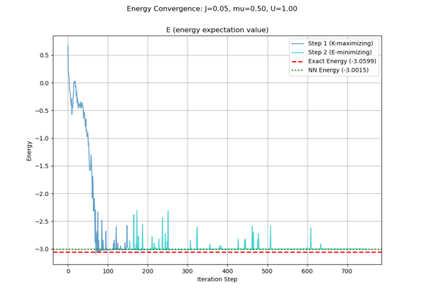
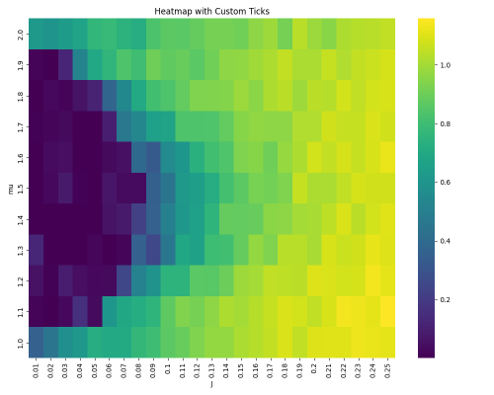
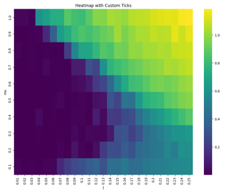

# 1Dボース・ハバードモデルのNQSによる分析レポート
(Analysis of 1D Bose-Hubbard Model using Neural Quantum States)

## 📖 概要 (Overview)
本プロジェクトは、機械学習を用いた変分モンテカルロ法（VMC）のシミュレーションコードを利用し、量子多体系である1次元ボース・ハバードモデルの物理的性質を分析したレポートです。

## 📜 コードの取り扱いについて (Code Availability)
本プロジェクトは、提供されたベースコードに対し、私が**独自の物理パラメータ導入や解析機能（相関関数の計算等）の追加実装**を行い、プロジェクトを完成させたものです。

現在は進行中の研究テーマに関連するため、機密保持の観点からコード本体の公開を控えております。
本ポートフォリオでは、実装によって得られた「解析結果」と「物理的考察」を中心に公開しています。

## 💡 私の貢献 (My Contribution)
私の役割は、提供されたコードを元に、適切な実験設計と解析の実装を行うことでした。具体的には以下のタスクを遂行しました。

1.  **理論的背景の理解:**
    * 変分モンテカルロ法（VMC）および Neural Quantum States (NQS) のアルゴリズム原理を学習し、実装に落とし込みました。
2.  **実験計画の立案:**
    * 物理的な相転移（超流動相からMott絶縁体相）を定量的に観測するため、エネルギー期待値だけでなく、**相関関数**の振る舞いに着目した実験系を設計しました。
3.  **結果の可視化と物理的考察:**
    * 得られたデータを可視化し、物理理論との整合性を検証しました。詳細はレポートにまとめています。

---

## 📊 結果のハイライト (Results Highlight)
シミュレーションの結果、機械学習を用いて **1D Bose-Hubbard Model** の量子相転移を判定することに成功しました。

### 1. エネルギー収束 (Optimization)

*図:1エネルギー期待値の最小化プロセス。基底状態へ収束している様子が確認できる。*

### 2. 相図の導出 (Phase Diagram)

*図:2相関関数の計算結果に基づいて描かれた相図*

## 📄 詳細レポート (Detailed Analysis)
物理的な背景、実験設定、および詳細な考察は、以下のレポートにまとめています。

**[➡️ 詳細な分析レポートはこちら (report/Analysis_Report.md)](report/Analysis_Report.md)**

---

## 📚 参考文献 (References)
本プロジェクトの実装および解析は、以下の先行研究に基づいています。

1.  **格子上のボース粒子系への応用:**
    * H. Saito, *"Solving the Bose-Hubbard Model eith Machine Learning"*, J. Phys. Soc. Jpn. **86**, 093001 (2017).
    * [[Journal]](https://journals.jps.jp/doi/10.7566/JPSJ.86.093001)

    * H. Saito, *"Machine Learning Technique to Find Quantum Many-Body Ground States of Bosons on a Lattice"*, J. Phys. Soc. Jpn. **87**, 014001 (2018).
    * [[Journal]](https://journals.jps.jp/doi/10.7566/JPSJ.87.014001)
    

